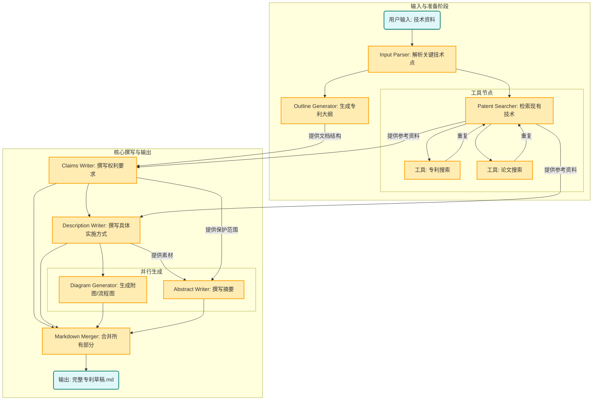

# 专利写作智能体


```bash
# 安装 Claude code
npm install -g @anthropic-ai/claude-code

# 安装其他依赖
pip install -r requirements.txt

# 配置环境变量
cp .mcp.json.example .mcp.json
cp .claude/settings.local.json.example .claude/settings.local.json

# 修改 .mcp.json 中的 API KEY，包括SERPAPI_API_KEY和EXA_API_KEY
# 修改 .claude/settings.local.json 中的 Token 和 URL（配置为第三方模型，如果不使用第三方，删除掉以ANTHROPIC开头的env即可）

#CLI
claude --dangerously-skip-permissions "根据 data/输入.docx 编写专利提案 " -p  --output-format stream-json --verbose

output/temp_9ba0a678-5210-42e0-8f52-31b47bf630f6 为示例输出

```

## GitHub Copilot 使用（已整理打包）

已新增一套可直接用于 Copilot 的专利撰写 Agent 资产：

- 全局指令：`.github/copilot-instructions.md`
- 可复用 Prompt：`.github/prompts/patent-writing-agent.prompt.md`
- 技能映射：`copilot_agent_pack/skills.md`
- 案例索引：`copilot_agent_pack/cases.md`

建议顺序：
1. 在仓库中启用 Copilot （`.github/copilot-instructions.md` 会被 Copilot 自动识别为仓库级指令）
2. 使用 `patent-writing-agent.prompt.md` 发起任务
3. 按 `skills.md` 分阶段输出并检查
4. 参考 `cases.md` 中案例做格式和质量对齐

### Workflow 设计


